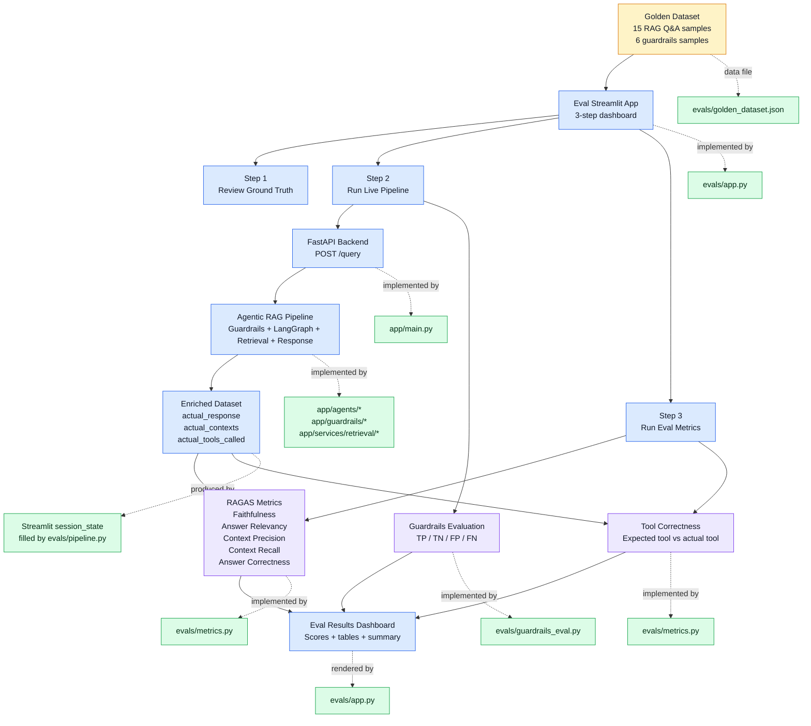

# kube-rag

Enterprise-grade agentic RAG over [Kubernetes](https://kubernetes.io/) documentation, with input guardrails, an LLM gateway, local reranking, full observability and an automated evaluation suite.

## Features

- **Agentic pipeline (LangGraph):** a planner classifies intent, a retriever fetches and reranks context, and a responder generates the answer. Per-thread conversation memory is kept with `MemorySaver`.
- **Guardrails (NeMo Guardrails):** off-topic and jailbreak requests are blocked before they reach the pipeline.
- **LLM gateway (Portkey):** all generation goes through Portkey to Groq models. Fallback, retry and caching are enabled through a saved Portkey config.
- **Retrieval:** Qdrant vector search followed by a local FlashRank cross-encoder reranker.
- **Embeddings:** `sentence-transformers` (`all-mpnet-base-v2`, 768-dim) by default, with optional Gemini embeddings (`gemini-embedding-2-preview`, 3072-dim).
- **Ingestion:** PDF, HTML, DOCX, PPTX and TXT loaders, chunking, and indexing into Qdrant.
- **Observability:** Pydantic Logfire spans and LangSmith traces. Logfire is optional, and the app starts without it.
- **Evals:** RAGAS metrics, tool correctness and guardrail confusion-matrix scoring, run from a Streamlit dashboard.

## Architecture

```
Streamlit UI ──► FastAPI /query ──► NeMo Guardrails ──blocked──► refusal
                                          │ pass
                                          ▼
                              LangGraph: planner ─┬─ conversational ──► responder
                                                  └─ technical ──► retriever ─► responder
                                                                     │              │
                                                          Qdrant + FlashRank   Portkey ─► Groq
```

More detail: [`ARCHITECTURE.md`](ARCHITECTURE.md) and the guides in [`DOCS/`](DOCS/).

## Project structure

```
app/
  main.py                  FastAPI app (/, /health, /graph, /query)
  config.py                Settings read from environment variables
  agents/                  LangGraph graph, state and nodes (planner, retriever, responder)
  guardrails/              NeMo Guardrails setup and Colang rules
  gateway/                 Portkey client and LangChain LLM factory
  services/retrieval/      Embeddings, Qdrant service, FlashRank reranker
  ingestion/               Loaders, chunking and the ingestion CLI (processor.py)
ui/app.py                  Streamlit chat UI
evals/                     Golden dataset, pipeline runner, metrics, eval dashboard
DATA/                      Source documents (true_data, noisy_data)
processed_data/            Parsed JSON chunks
DOCS/                      Design docs and guides
Dockerfile                 Backend image
ui.Dockerfile              UI image
docker-compose.yml         Backend, UI and optional local Qdrant
```

## Prerequisites

- Python 3.11
- Docker and Docker Compose (for the containerised setup)
- A [Groq](https://console.groq.com/keys) API key
- A [Portkey](https://portkey.ai) API key with a Groq integration (this project uses the slug `@kube-rage-groq`)
- A Qdrant instance: Qdrant Cloud, or the local container (`--profile local`)
- Optional: Logfire token, LangSmith key, Gemini key

## Configuration

Copy the example file and fill it in:

```bash
cp .env.docker.example .env
```

| Variable | Required | Description |
|---|---|---|
| `GROQ_API_KEY` | yes | Groq key used by the guardrails and the gateway |
| `GROQ_FALLBACK_API_KEY` | no | Secondary Groq key |
| `PORTKEY_API_KEY` | yes | Portkey API key |
| `PORTKEY_GROQ_SLUG` | no | Portkey Groq integration slug (default `kube-rage-groq`) |
| `PORTKEY_CONFIG_ID` | no | Saved Portkey config ID (`pc-...`) enabling fallback, retry and cache. Without it, requests go straight to the primary model |
| `QDRANT_CLUSTER_ENDPOINT` | yes | Qdrant URL. Docker default is `http://qdrant:6333` |
| `QDRANT_API_KEY` | yes | Qdrant API key |
| `EMBEDDING_MODEL` | no | `sentence-transformers` (default) or `gemini` |
| `GEMINI_API_KEY` | if `gemini` | Gemini API key |
| `GROQ_MODEL` | no | Default `openai/gpt-oss-120b` |
| `LOGFIRE_TOKEN` | no | Enables Logfire |
| `LANGSMITH_TRACING`, `LANGSMITH_API_KEY`, `LANGSMITH_PROJECT`, `LANGSMITH_ENDPOINT` | no | LangSmith tracing |
| `JUDGE_GROQ` | evals | Separate Groq key for the eval judge, so eval runs don't use up the production key |
| `BACKEND_URL` | UI only | Backend URL. Set by docker-compose; set it yourself when running the UI outside Docker |

`.env.docker.example` doesn't list `PORTKEY_API_KEY`, `PORTKEY_GROQ_SLUG`, `PORTKEY_CONFIG_ID` or `JUDGE_GROQ`, so add them yourself.

### Models

Groq no longer lists `llama-3.1-8b-instant` or `llama-3.3-70b-versatile` for this project's key. The project now uses:

- Primary: `@kube-rage-groq/openai/gpt-oss-120b`
- Fallback (via saved config): `@kube-rage-groq/openai/gpt-oss-20b`
- Guardrails: `openai/gpt-oss-20b`

Check which models your key can use with `GET https://api.groq.com/openai/v1/models`.

### Portkey saved config

The Portkey workspace rejects inline configs, so create a saved one: Portkey dashboard → **Configs** → **Create**, paste the JSON below, save, and put the resulting `pc-...` ID in `.env` as `PORTKEY_CONFIG_ID`.

```json
{
  "strategy": {"mode": "fallback"},
  "cache": {"mode": "simple"},
  "retry": {"attempts": 2, "on_status_codes": [429, 503]},
  "targets": [
    {"override_params": {"model": "@kube-rage-groq/openai/gpt-oss-120b"}},
    {"override_params": {"model": "@kube-rage-groq/openai/gpt-oss-20b"}}
  ]
}
```

## Run with Docker

```bash
docker-compose up --build                   # backend + UI, using the Qdrant in your .env
docker-compose --profile local up --build   # also starts a local Qdrant container
```

| Service | URL |
|---|---|
| Streamlit UI | http://localhost:8501 |
| Backend API | http://localhost:8000 (container port 8080) |
| API docs | http://localhost:8000/docs |
| Local Qdrant (`local` profile) | http://localhost:6333 |

The first build takes several minutes (torch and the other dependencies), and the first start downloads the embedding and reranker models. The UI waits for the backend health check (`/health`) before starting.

## Run locally (without Docker)

```bash
python3.11 -m venv .venv && source .venv/bin/activate
pip install -r requirements.txt

uvicorn app.main:app --reload --port 8000                    # backend
BACKEND_URL=http://localhost:8000 streamlit run ui/app.py    # UI
```

## Ingest data

Put source documents in `DATA/true_data` (clean) or `DATA/noisy_data` (noisy), then run:

```bash
python -m app.ingestion.processor DATA/true_data true     # clean data only
python -m app.ingestion.processor DATA/noisy_data noisy   # add noisy data
```

Flags: `--wipe` drops and recreates the whole collection first. `--wipe-source` removes only the vectors for the source type being ingested. If you change `EMBEDDING_MODEL`, re-ingest with `--wipe`, because the vector dimensions differ (768 vs 3072). More examples in [`usefulCommands.md`](usefulCommands.md).

## API

| Method | Path | Description |
|---|---|---|
| GET | `/` | Welcome message |
| GET | `/health` | Health check, used by Docker |
| GET | `/graph` | PNG of the LangGraph workflow |
| POST | `/query` | Ask a question |

```bash
curl -X POST http://localhost:8000/query \
  -H 'Content-Type: application/json' \
  -d '{"q": "What is a Kubernetes pod?", "thread_id": "demo"}'
```

The response contains `question`, `answer`, `thought_process` (the steps taken), `status` and `sources`. Reuse the same `thread_id` to keep conversation memory. If the pipeline fails, the endpoint still returns HTTP 200 with `"status": "error"`.

## Evaluation

The eval dashboard runs the golden dataset (15 RAG Q&A samples and 6 guardrail samples) against the live backend and scores it:

```bash
streamlit run evals/app.py
```

Metrics: RAGAS faithfulness, answer relevancy, context precision, context recall and answer correctness; tool correctness (expected vs actual tool); and guardrail TP/TN/FP/FN. The judge uses `JUDGE_GROQ`. Details: [`DOCS/10_EVALS.md`](DOCS/10_EVALS.md) and [`DOCS/11_EVALS_PIPELINE.md`](DOCS/11_EVALS_PIPELINE.md).



## Troubleshooting

| Symptom | Cause and fix |
|---|---|
| `ModuleNotFoundError` on backend start | A package is missing from `requirements-prod.txt` (the file the backend image installs from) |
| `Missing credentials` from `ChatOpenAI` | `PORTKEY_API_KEY` isn't reaching the container. Check `.env` and `docker-compose.yml` |
| `model_not_found` (404) from Groq | The model was retired or isn't enabled for your key. Pick one from `GET /openai/v1/models` |
| Portkey 400 "inline configs disabled" | Create a saved config and set `PORTKEY_CONFIG_ID` |
| UI shows "connection refused" | The backend wasn't ready yet. Wait for it to become healthy |

More in [`DOCS/06_KNOWN_GOTCHAS.md`](DOCS/06_KNOWN_GOTCHAS.md).

## Documentation

All design docs are in [`DOCS/`](DOCS/): system overview, ingestion engine, node intelligence, tracing, environment variables, gotchas, FlashRank reranking, guardrails, LLM gateway and evals.
