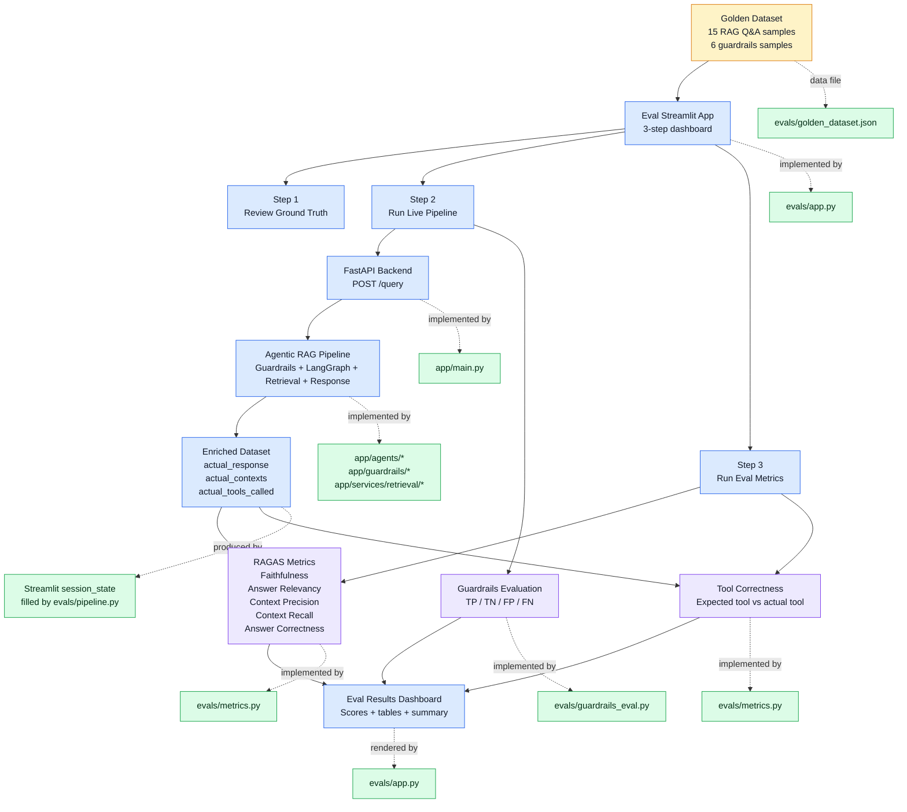

# kube-rag

Enterprise-Grade RAG Application for kubernetes (https://kubernetes.io/)


```mermaid
flowchart TD
A["Golden Dataset<br/>15 RAG Q&A samples<br/>6 guardrails samples"]
A_FILE["evals/golden_dataset.json"]

B["Eval Streamlit App<br/>3-step dashboard"]
B_FILE["evals/app.py"]

C["Step 1<br/>Review Ground Truth"]
D["Step 2<br/>Run Live Pipeline"]
E["Step 3<br/>Run Eval Metrics"]

F["FastAPI Backend<br/>POST /query"]
F_FILE["app/main.py"]

G["Agentic RAG Pipeline<br/>Guardrails + LangGraph + Retrieval + Response"]
G_FILE["app/agents/*<br/>app/guardrails/*<br/>app/services/retrieval/*"]

H["Enriched Dataset<br/>actual_response<br/>actual_contexts<br/>actual_tools_called"]
H_FILE["Streamlit session_state<br/>filled by evals/pipeline.py"]

I["Guardrails Evaluation<br/>TP / TN / FP / FN"]
I_FILE["evals/guardrails_eval.py"]

J["RAGAS Metrics<br/>Faithfulness<br/>Answer Relevancy<br/>Context Precision<br/>Context Recall<br/>Answer Correctness"]
J_FILE["evals/metrics.py"]

K["Tool Correctness<br/>Expected tool vs actual tool"]
K_FILE["evals/metrics.py"]

L["Eval Results Dashboard<br/>Scores + tables + summary"]
L_FILE["evals/app.py"]

A --> B
B --> C
B --> D
B --> E

D --> F
F --> G
G --> H
D --> I

E --> J
E --> K
H --> J
H --> K
I --> L
J --> L
K --> L

A -. data file .-> A_FILE
B -. implemented by .-> B_FILE
F -. implemented by .-> F_FILE
G -. implemented by .-> G_FILE
H -. produced by .-> H_FILE
I -. implemented by .-> I_FILE
J -. implemented by .-> J_FILE
K -. implemented by .-> K_FILE
L -. rendered by .-> L_FILE

classDef flow fill:#DBEAFE,stroke:#2563EB,color:#111827
classDef program fill:#DCFCE7,stroke:#16A34A,color:#052E16
classDef data fill:#FEF3C7,stroke:#D97706,color:#111827
classDef metric fill:#EDE9FE,stroke:#7C3AED,color:#111827

class B,C,D,E,F,G,H,L flow
class A data
class I,J,K metric
class A_FILE,B_FILE,F_FILE,G_FILE,H_FILE,I_FILE,J_FILE,K_FILE,L_FILE program
```

BE:

```bash
uvicorn app.main:app --reload --port 8000
```

UI:

```bash
streamlit run ui/app.py
```
